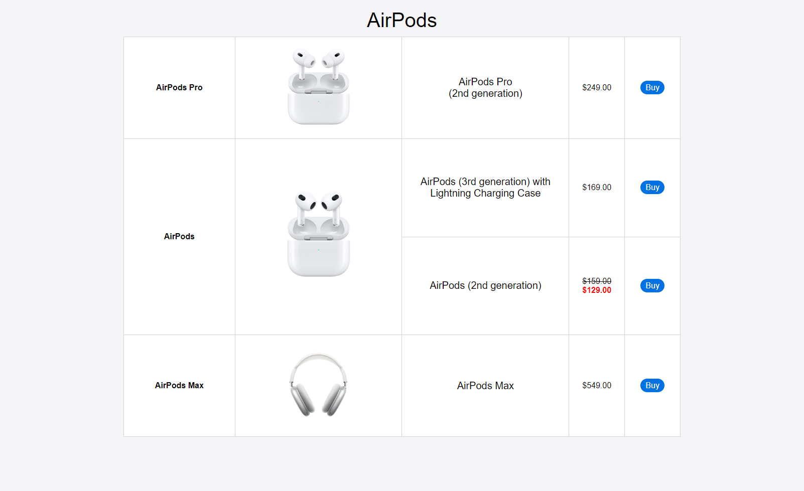
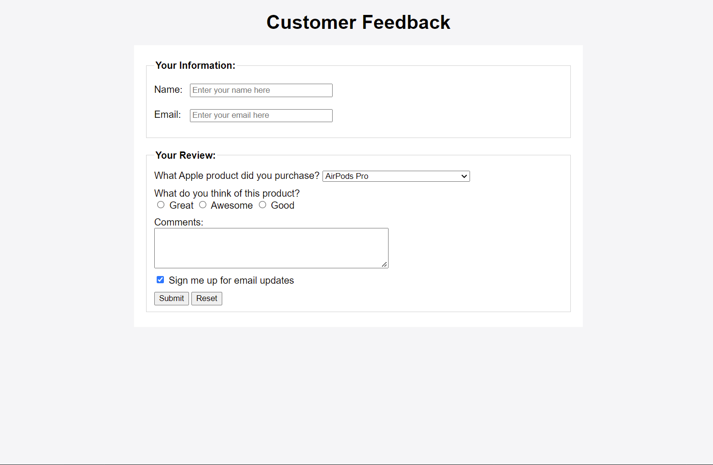

# OIM3690 Web Technologies - 2023 Spring - Homework 2

**Note**: all *.html* files required below should be located under *WebTech* folder. All *.css* files should be located under *WebTech/styles* folder. All images files should be located under *WebTech/images* folder.

## General Instructions:

- This is an individual assignment.
- 15 points will be deducted for each day or partial day late. 
- There are 5 questions in this homework. You need to create multiple `.html` files and any necessary `.css` files. 
- At the bottom of each `.html` file, include the Honors Code statement using **HTML comments**, "I, [your name], pledge my honor that I have neither received nor provided unauthorized assistance during the completion of this work."

## 1. Table (20 points)

Create the table shown below. You can find the pictures of all the products in [images](./images) folder. All styles must be done with internal CSS or external CSS. **Inline CSS is not allowed.**

- Table should be centered.
- Height of each `tr` should be `20vh`.
- All the text is centered, with `Helvetica` font.
- The heading “AirPods” is created using the `<caption>` tag. 
- Table border color is `lightgray`.
- The widths of columns are: `20%`, `30%`, `30%`, `10%` and `10%`.
- Use `<a>` tags (not `button` tags) to create "Buy" links. Each link should take the user to the real product page on apple.com or amazon.com.
- The `background-color` property of the links should be `#0077ed` (same as Apple official website).
- Save it as `hw2-1.html` under `WebTech` folder. 

## 2. "Table" Again (20 points)

Recreate the "table" above (from Q1) **WITHOUT** using the `table` element. All styles must be done with internal CSS or external CSS. **Inline CSS is not allowed.**

- You could use any layout approach such as **normal flow with floats**, **flexbox** or **grids**.
- All styles should be same as in Q1 (some elements could be responsive if desired).
- Borders could be removed.
- Save it as `hw2-2.html` under `WebTech` folder.

## 3. Form (20 points)
Create the form shown below. All styles must be done with internal CSS or external CSS. **Inline CSS is not allowed.**

- The form should be centered.
- The `method` attribute should be set to `"POST"` and the `action` attribute should be set to `"https://oim-apis.up.railway.app/form2"`.
- All the text should use `Arial` font.
- Use `<fieldset>` to group controls. Learn `<fieldset>` [here](https://developer.mozilla.org/en-US/docs/Web/HTML/Element/fieldset).
- The `border` color of the `<fieldset>` element should be lightgray.
- Use `<datalist>` for country names. Learn `<datalist>` [here](https://developer.mozilla.org/en-US/docs/Web/HTML/Element/datalist). You should create at least three `<option>` elements, including your own country name.
- Associate each `<label>` with its corresponding `<input>` element.
- The "*Sign me up for email updates*" checkbox should be pre-selected.
- You should add a background color to the page, and a different background color to the form itself.
- Save it as `hw2-3.html` under `WebTech` folder. 

## 4. *"Cloning"* Apple's Navigation Bar (15 points)

Replicate the navigation bar of the [homepage](https://www.apple.com/) of Apple using HTML and CSS.

- You need to write html and CSS code **from scratch**. 
- You can use either internal CSS or external CSS. **Inline CSS is not allowed.**
- Use the exactly same colors as in original website. Do not assume it is using pure black and white colors.
- All links don't have to be functional. You can use `href="#"` for all the `<a>` tags.
- You don't have to implement the dropdown menu. However, you need to implement the effect of a link when the user mouses over it, i.e., the background/text color should change.
- You don't need to implement **search** functionality. You can create an invalid link instead.
- This is a challenging task. It is acceptable if you cannot replicate the original one 100%.
- If you can replicate the rest of the homepage of Apple, feel free to do so and extra credits will be awarded according.
- Save it as `hw2-4.html` under the `WebTech` folder. 

## 5. Redesign *index.html* (20 points)

- Use the existing *index.html* file. You don't need to create new file.
- Remove the existing heading "All About _Your Name_" and "Quick Links" section.
- Create the horizontal navigation bar on the top of the page that includes both your name and links.
  - Position your name on the left or right of the navigation bar.
  - The horizontal nav bar should have multiple links, including "Home" (linking to "#" which means the current page), "About Me", "My Interests", "Contact Information" (linking to different sections in the page according), and a dropdown menu. 
  - The dropdown menu should be labeled "Homework 2", and have the following options: "hw2-1", "hw2-2", "hw2-3" and "hw2-4" (linking to the HTML files created for this assignment accordingly). Check out the [example](https://www.w3schools.com/css/tryit.asp?filename=trycss_dropdown_navbar) on W3Schools. 
  - Use appropriate CSS styling to customize the appearance of the navigation bar.
  - (Optional) Consider making the navigation bar sticky to the top of the page .

## 6. Additional Requirements
1. If you use any new HTML tags or attributes that we have not covered in class, add an HTML comment next to the element describing the new tag/attribute and where you learned it from.
2. If you use any new CSS properties that we have not covered in class, add a CSS comment next to the new property(ies) describing them and where you learned them from.
3. Ensure that all words are spelled correctly.
4. Test your web pages on different screen sizes to ensure compatibility and a visually pleasing appearance on various devices. You may use Chrome's DevTools to check your website's appearance on different screen sizes.
5. Ensure that your pages pass HTML validation without errors by using validators such as the [W3C validator](https://validator.w3.org/).

## Submission (5 points)

1. Update *sitemap.html* by adding links to the 5 *.html* files.
2. ***Commit and push*** to GitHub.
3. Create a release.
   - Use tag version '`hw2`' for this release. You don't need to attach any files.
   - Learn more about [Managing releases in a repository](https://docs.github.com/en/github/administering-a-repository/releasing-projects-on-github/managing-releases-in-a-repository).

